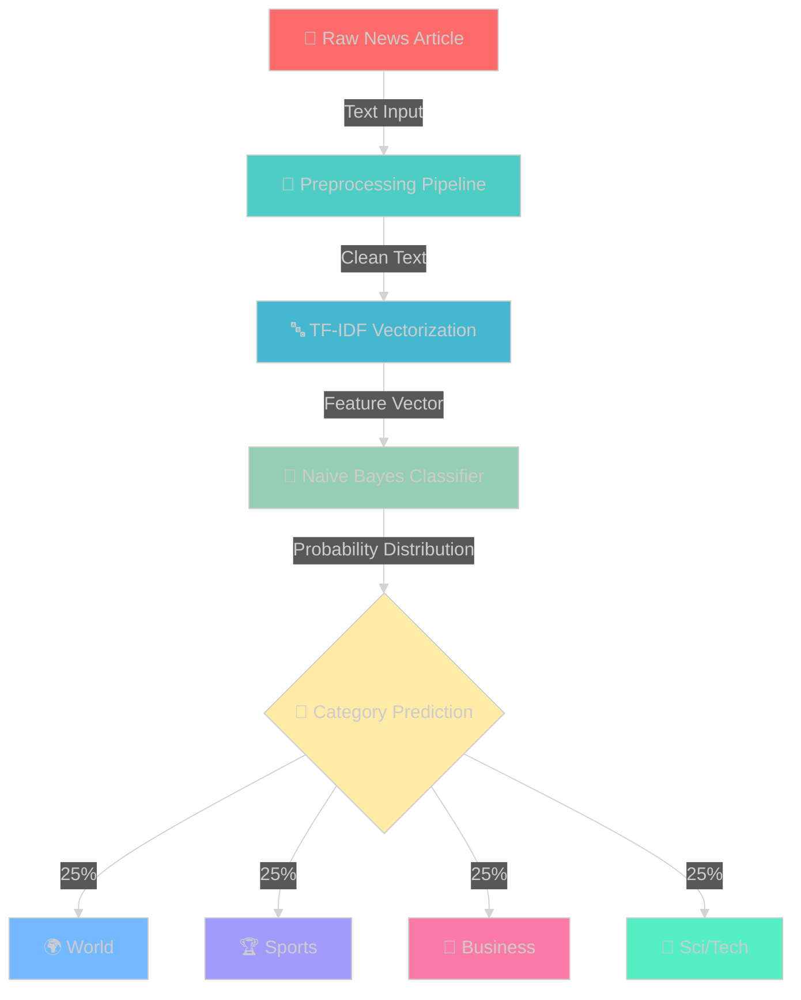
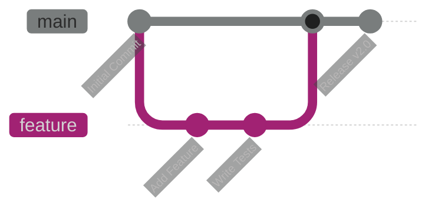

<div align="center">

<!-- HEADER WITH GRADIENT -->


<p align="center">
  <a href="#"></a>
  <a href="#"></a>
  <a href="#"></a>
  <a href="#"></a>
  <a href="#"></a>
</p>

<p align="center">
  
  
  
</p>

### 🎯 *Classify 120K+ news articles with 94% accuracy in under 100ms*

<p align="center">
  <a href="#-highlights"><b>Highlights</b></a> •
  <a href="#-live-demo"><b>Demo</b></a> •
  <a href="#-quick-start"><b>Quick Start</b></a> •
  <a href="#-api-playground"><b>API</b></a> •
  <a href="#-architecture"><b>Architecture</b></a> •
  <a href="#-team"><b>Team</b></a>
</p>

</div>

<br/>

<!-- ANIMATED DIVIDER -->


## 🎪 Highlights

<table>
<tr>
<td width="33%" align="center">

<h3>⚡ Lightning Fast</h3>
<p><b>< 100ms</b> response time<br/>Real-time predictions</p>
</td>
<td width="33%" align="center">

<h3>🎯 Highly Accurate</h3>
<p><b>94.2%</b> accuracy<br/>Trained on 127K articles</p>
</td>
<td width="33%" align="center">

<h3>🚀 Production Ready</h3>
<p>RESTful API<br/>Beautiful UI</p>
</td>
</tr>
</table>

<div align="center">

```ascii
╔═══════════════════════════════════════════════════════════════════════════════╗
║                                                                               ║
║   📰 WORLD    🏆 SPORTS    💼 BUSINESS    🔬 SCI/TECH                         ║
║                                                                               ║
║   ┌─────────────────────────────────────────────────────────────┐           ║
║   │  "Apple unveils revolutionary AI chip..."                    │           ║
║   │                                                               │           ║
║   │  → Processing with TF-IDF + Naive Bayes...                   │           ║
║   │  → Analyzing 5000+ features...                               │           ║
║   │  → Prediction: SCI/TECH (94% confidence) ✓                   │           ║
║   └─────────────────────────────────────────────────────────────┘           ║
║                                                                               ║
╚═══════════════════════════════════════════════════════════════════════════════╝
```

</div>

<br/>

<!-- ANIMATED DIVIDER -->


## 🎬 Live Demo

<div align="center">

### 🏠 **Home Dashboard** — Sleek & Modern Interface
<kbd></kbd>

<br/><br/>

### 🎯 **Prediction Engine** — AI in Action
<kbd></kbd>

<br/><br/>

### 🔌 **API Documentation** — Developer Friendly
<kbd></kbd>

<br/><br/>

### ℹ️ **About Section** — Know The Tech
<kbd></kbd>

</div>

<br/>

<!-- ANIMATED DIVIDER -->


## 🏗️ Architecture

<div align="center">



</div>

### 🧠 **ML Pipeline Breakdown**

<table>
<tr>
<td width="25%">

**🔹 Stage 1**
### Preprocessing
```python
• Lowercase
• Remove URLs
• Strip punctuation
• Filter stopwords
• Tokenize
```

</td>
<td width="25%">

**🔹 Stage 2**
### Vectorization
```python
• TF-IDF transform
• 5000 features
• 1-2 gram range
• Sparse matrix
• Normalized
```

</td>
<td width="25%">

**🔹 Stage 3**
### Classification
```python
• Multinomial NB
• Prior probability
• Likelihood calc
• Posterior prob
• Argmax prediction
```

</td>
<td width="25%">

**🔹 Stage 4**
### Output
```python
• Category label
• Confidence score
• Response JSON
• < 100ms latency
• Log metrics
```

</td>
</tr>
</table>

<br/>

<!-- ANIMATED DIVIDER -->


## 📊 Performance Metrics

<div align="center">

<table>
<tr>
<td>

### 🎯 **Accuracy Metrics**

| Metric | Score |
|:-------|------:|
| **Overall Accuracy** | `94.2%` |
| **Precision (Avg)** | `93.8%` |
| **Recall (Avg)** | `94.1%` |
| **F1-Score (Avg)** | `93.9%` |

</td>
<td>

### ⚡ **Speed Metrics**

| Operation | Time |
|:----------|-----:|
| **Training Time** | `3.2 min` |
| **Inference (Single)** | `< 100 ms` |
| **Batch (100 articles)** | `< 2 sec` |
| **Model Load Time** | `< 500 ms` |

</td>
</tr>
</table>

### 📈 **Per-Category Performance**

```
┌─────────────────────────────────────────────────────────────────┐
│                                                                 │
│  🌍 World     ████████████████████░  94.5%  (F1: 0.943)        │
│  🏆 Sports    █████████████████████  95.1%  (F1: 0.951)        │
│  💼 Business  ███████████████████░░  93.2%  (F1: 0.930)        │
│  🔬 Sci/Tech  ████████████████████░  94.0%  (F1: 0.938)        │
│                                                                 │
└─────────────────────────────────────────────────────────────────┘
```

### 💾 **Model Specifications**


</div>

<br/>

<!-- ANIMATED DIVIDER -->


## ⚡ Quick Start

<div align="center">

### 📦 **Installation in 3 Steps**

</div>

```bash
# 1️⃣ Clone the repository
git clone https://github.com/Guna42/ClassyNews.git && cd ClassyNews

# 2️⃣ Install dependencies
pip install -r requirements.txt

# 3️⃣ Launch the app
python app.py
```

<div align="center">

🎉 **That's it!** Open `http://127.0.0.1:5000` and start classifying!

</div>

### 🐳 **Docker Deployment** (Optional)

```dockerfile
# Quick Docker setup
docker build -t classynews .
docker run -p 5000:5000 classynews

# Or use docker-compose
docker-compose up -d
```

<br/>

<!-- ANIMATED DIVIDER -->


## 🔌 API Playground

### 🎯 **Endpoint: Classify News**

<table>
<tr>
<td width="50%">

**Request**

```http
POST /predict HTTP/1.1
Host: localhost:5000
Content-Type: application/json

{
  "text": "Tesla announces record profits"
}
```

</td>
<td width="50%">

**Response**

```json
{
  "prediction": "Business",
  "confidence": 0.96,
  "category_id": 2,
  "timestamp": "2024-12-10T15:30:00Z",
  "processing_time_ms": 87
}
```

</td>
</tr>
</table>

### 💻 **Code Examples**

<details>
<summary><b>🐍 Python</b></summary>

```python
import requests

# Single prediction
response = requests.post('http://localhost:5000/predict', 
    json={'text': 'AI breakthrough in quantum computing'})
result = response.json()
print(f"Category: {result['prediction']} ({result['confidence']:.1%})")

# Batch prediction
articles = [
    "Stock market hits all-time high",
    "Championship game goes to overtime",
    "Scientists discover new planet"
]

for article in articles:
    response = requests.post('http://localhost:5000/predict', 
        json={'text': article})
    print(f"'{article}' → {response.json()['prediction']}")
```

</details>

<details>
<summary><b>🟨 JavaScript</b></summary>

```javascript
// Using Fetch API
async function classifyNews(text) {
  const response = await fetch('http://localhost:5000/predict', {
    method: 'POST',
    headers: { 'Content-Type': 'application/json' },
    body: JSON.stringify({ text })
  });
  
  const result = await response.json();
  console.log(`Category: ${result.prediction} (${result.confidence})`);
  return result;
}

// Example usage
classifyNews('Apple releases new MacBook Pro with M3 chip');
```

</details>

<details>
<summary><b>🌊 cURL</b></summary>

```bash
# Simple request
curl -X POST http://localhost:5000/predict \
  -H "Content-Type: application/json" \
  -d '{"text": "Olympic gold medalist breaks world record"}'

# With pretty print
curl -X POST http://localhost:5000/predict \
  -H "Content-Type: application/json" \
  -d '{"text": "Federal Reserve announces interest rate decision"}' \
  | jq '.'
```

</details>

<br/>

<!-- ANIMATED DIVIDER -->


## 🗂️ Project Structure

```
ClassyNews/
│
├── 🚀 app.py                          # Flask application & API routes
├── 📓 train_model.ipynb               # Complete training pipeline
├── 🤖 news_classifier.joblib          # Trained Naive Bayes model
├── 🔤 tfidf_vectorizer.joblib         # TF-IDF transformer
├── 📋 requirements.txt                # Python dependencies
├── 🐳 Dockerfile                      # Container configuration
├── 📖 README.md                       # You are here!
│
├── 📁 templates/                      # Frontend HTML pages
│   ├── 🏠 index.html                  # Home dashboard
│   ├── 🎯 predict.html                # Prediction interface
│   ├── ℹ️  about.html                 # Documentation
│   └── 🔌 api.html                    # API reference
│
├── 📁 static/                         # Assets & styling
│   ├── 🎨 css/
│   │   ├── style.css
│   │   └── animations.css
│   ├── ⚡ js/
│   │   ├── main.js
│   │   └── predict.js
│   └── 🖼️  images/
│       └── logo.png
│
├── 📁 models/                         # Model artifacts
│   └── checkpoints/
│
├── 📁 data/                           # Dataset storage
│   ├── raw/
│   └── processed/
│
├── 📁 notebooks/                      # Jupyter notebooks
│   ├── EDA.ipynb
│   ├── experiments.ipynb
│   └── model_comparison.ipynb
│
├── 📁 tests/                          # Unit & integration tests
│   ├── test_api.py
│   └── test_model.py
│
└── 📁 screenshots/                    # UI demos
    ├── Home.png
    ├── Predict.png
    ├── API.png
    └── About.png
```

<br/>

<!-- ANIMATED DIVIDER -->


## 🎓 Training Your Own Model

<details>
<summary><b>📚 Click to expand training guide</b></summary>

### **Step 1: Load Dataset**

```python
from datasets import load_dataset

# Load AG News dataset from HuggingFace
dataset = load_dataset("ag_news")

print(f"Training samples: {len(dataset['train'])}")
print(f"Test samples: {len(dataset['test'])}")
```

### **Step 2: Preprocess Text**

```python
import re
import nltk
from nltk.corpus import stopwords

nltk.download('stopwords')
stop_words = set(stopwords.words('english'))

def preprocess(text):
    # Lowercase
    text = text.lower()
    
    # Remove URLs
    text = re.sub(r'http\S+|www\S+|https\S+', '', text)
    
    # Remove punctuation
    text = re.sub(r'[^\w\s]', '', text)
    
    # Remove stopwords
    tokens = [word for word in text.split() if word not in stop_words]
    
    return ' '.join(tokens)

# Apply preprocessing
train_texts = [preprocess(item['text']) for item in dataset['train']]
```

### **Step 3: Train Model**

```python
from sklearn.feature_extraction.text import TfidfVectorizer
from sklearn.naive_bayes import MultinomialNB
from sklearn.metrics import classification_report
import joblib

# TF-IDF Vectorization
vectorizer = TfidfVectorizer(
    max_features=5000,
    ngram_range=(1, 2),
    min_df=5,
    max_df=0.8
)

X_train = vectorizer.fit_transform(train_texts)
y_train = [item['label'] for item in dataset['train']]

# Train Naive Bayes
model = MultinomialNB(alpha=0.1)
model.fit(X_train, y_train)

# Evaluate
X_test = vectorizer.transform(test_texts)
y_pred = model.predict(X_test)
print(classification_report(y_test, y_pred))

# Save models
joblib.dump(model, 'news_classifier.joblib')
joblib.dump(vectorizer, 'tfidf_vectorizer.joblib')
```

### **Step 4: Test Predictions**

```python
def predict_category(text):
    text_clean = preprocess(text)
    text_vector = vectorizer.transform([text_clean])
    prediction = model.predict(text_vector)[0]
    
    categories = ['World', 'Sports', 'Business', 'Sci/Tech']
    return categories[prediction]

# Test
test_article = "Apple announces new iPhone with AI features"
print(f"Category: {predict_category(test_article)}")
```

</details>

<br/>

<!-- ANIMATED DIVIDER -->


## 🎯 Use Cases

<table>
<tr>
<td width="50%">

### 📰 **News Aggregators**
- Auto-categorize incoming articles
- Organize content by topic
- Smart content routing
- Reduce manual tagging

### 🔍 **Media Monitoring**
- Track coverage by category
- Analyze topic distribution
- Monitor competitor news
- Generate category reports

</td>
<td width="50%">

### 📊 **Research & Analytics**
- Study news trends
- Analyze topic patterns
- Generate insights
- Academic research

### 📱 **Content Apps**
- Personalized news feeds
- Topic-based notifications
- Smart recommendations
- Enhanced user experience

</td>
</tr>
</table>

<br/>

<!-- ANIMATED DIVIDER -->


## 🗺️ Roadmap

<div align="center">

### **🚀 Coming Soon**

</div>

```
Phase 1 - Q1 2025                  Phase 2 - Q2 2025                  Phase 3 - Q3 2025
├─ ✅ Core classification         ├─ 🔄 BERT integration             ├─ 📱 Mobile app
├─ ✅ Flask API                   ├─ 🔄 Real-time scraping           ├─ 📊 Analytics dashboard
├─ ✅ Web interface               ├─ 🔄 More categories              ├─ 🌍 Multi-language support
└─ ✅ Basic deployment            ├─ 🔄 Cloud deployment             └─ 🤖 Auto-retraining pipeline
                                   └─ 🔄 Model monitoring
```

<table>
<tr>
<td width="33%">

### 🎯 **Accuracy Improvements**
- [ ] BERT/Transformer models
- [ ] Ensemble methods
- [ ] Active learning
- [ ] Target: **98%+ accuracy**

</td>
<td width="33%">

### 🌐 **New Features**
- [ ] 10+ new categories
- [ ] Multi-language support
- [ ] Sentiment analysis
- [ ] Named entity recognition

</td>
<td width="33%">

### ☁️ **Infrastructure**
- [ ] AWS/GCP deployment
- [ ] Kubernetes scaling
- [ ] CI/CD pipeline
- [ ] Monitoring & alerts

</td>
</tr>
</table>

<br/>

<!-- ANIMATED DIVIDER -->


## 🤝 Contributing

<div align="center">

**We ❤️ contributions! Help us make ClassyNews even better.**

</div>



### **🔥 Ways to Contribute**

<table>
<tr>
<td>

**🐛 Bug Reports**
- Found a bug? Open an issue
- Include reproduction steps
- Add error logs
- Suggest a fix

</td>
<td>

**✨ Feature Requests**
- Have an idea? Share it!
- Explain the use case
- Provide examples
- Discuss implementation

</td>
<td>

**📝 Documentation**
- Improve README
- Add tutorials
- Fix typos
- Translate content

</td>
<td>

**💻 Code**
- Fix bugs
- Add features
- Improve performance
- Write tests

</td>
</tr>
</table>

### **📋 Contribution Process**

```bash
# 1. Fork the repository
# 2. Create your feature branch
git checkout -b feature/AmazingFeature

# 3. Make your changes and commit
git commit -m '✨ Add some AmazingFeature'

# 4. Push to the branch
git push origin feature/AmazingFeature

# 5. Open a Pull Request
```

<br/>

<!-- ANIMATED DIVIDER -->


## 👥 Team

<div align="center">

### **🌟 Meet The Brilliant Minds Behind ClassyNews**

<table>
<tr>
<td align="center" width="20%">
<a href="https://github.com/Guna42">

<br/>
<sub><b>Guna Vardhan Byraju</b></sub>
</a>
<br/>
<sub>🧠 ML Engineer</sub>
<br/>
<a href="https://github.com/Guna42"></a>
</td>
<td align="center" width="20%">

<br/>
<sub><b>Sumanth Oruganti</b></sub>
<br/>
<sub>⚡ Backend Developer</sub>
<br/>

</td>
<td align="center" width="20%">

<br/>
<sub><b>Jesweer K</b></sub>
<br/>
<sub>🎨 Frontend Developer</sub>
<br/>

</td>
<td align="center" width="20%">

<br/>
<sub><b>Poorna Ravi Teja</b></sub>
<br/>
<sub>📊 Data Scientist</sub>
<br/>

</td>
<td align="center" width="20%">

<br/>
<sub><b>Subhash Jetty</b></sub>
<br/>
<sub>🔧 DevOps Engineer</sub>
<br/>

</td>
</tr>
</table>


</div>

<br/>

<!-- ANIMATED DIVIDER -->


## 📜 License

<div align="center">

This project is licensed under the **MIT License** - see the [LICENSE](LICENSE) file for details.

```
MIT License | Copyright (c) 2024 ClassyNews Team
Permission is hereby granted, free of charge, to any person obtaining a copy...
```

</div>

<br/>

<!-- ANIMATED DIVIDER -->


## 🎖️ Acknowledgments

<div align="center">

**Standing on the shoulders of giants** 🚀

<table>
<tr>
<td align="center" width="25%">

<br/>
<b>scikit-learn</b>
<br/>
<sub>ML algorithms</sub>
</td>
<td align="center" width="25%">

<br/>
<b>NLTK</b>
<br/>
<sub>NLP processing</sub>
</td>
<td align="center" width="25%">

<br/>
<b>Flask</b>
<br/>
<sub>Web framework</sub>
</td>
<td align="center" width="25%">

<br/>
<b>HuggingFace</b>
<br/>
<sub>AG News dataset</sub>
</td>
</tr>
</table>

Special thanks to:
- **Xiang Zhang** for the AG News dataset
- **The open-source community** for amazing tools
- **Our users** for valuable feedback

</div>

<br/>

<!-- ANIMATED DIVIDER -->
